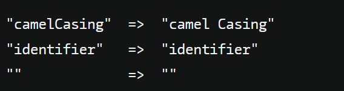
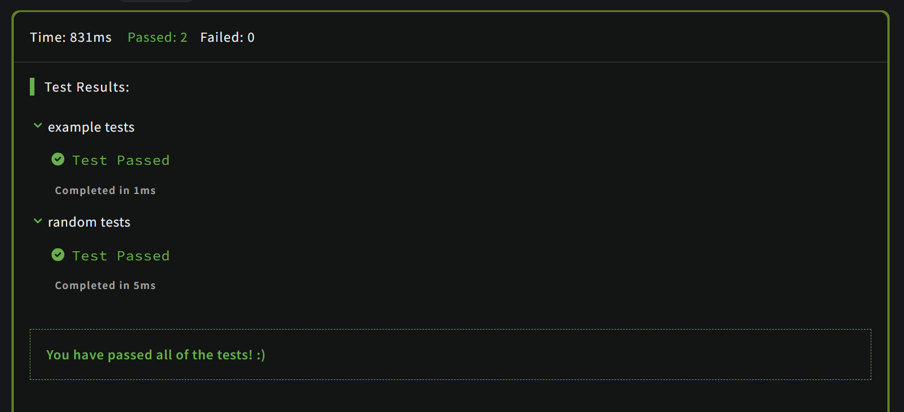

# [Break camelCase](https://www.codewars.com/kata/5208f99aee097e6552000148/train/javascript)
28.06.2024

Complete the solution so that the function will break up camel casing, using a space between words.


```js
function solution(string) {
  if(!string) { return ''}
  return string.split('').map((element)=>{ if(element.toLowerCase() !==element){
      element = ' '+ element
    }
      return element
    }
  ).join('')
}

```



