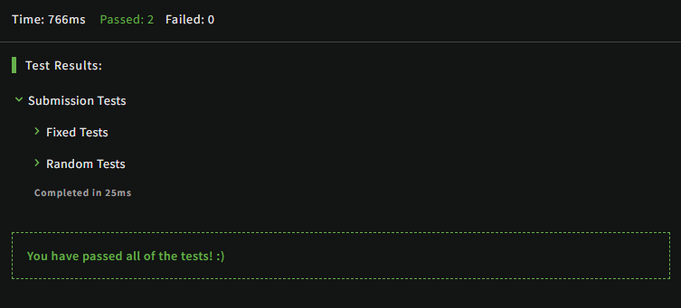

# [Count characters in your string](https://www.codewars.com/kata/52efefcbcdf57161d4000091/train/javascript)
2.07.2024

The main idea is to count all the occurring characters in a string. If you have a string like aba, then the result should be {'a': 2, 'b': 1}.

What if the string is empty? Then the result should be empty object literal, {}.

```js
function count(string) {
  const result = {}

  string.split('').forEach((literal)=>{
    result[literal] = string.split('').filter((element)=> element===literal).length
  })

  return result;
}
```

