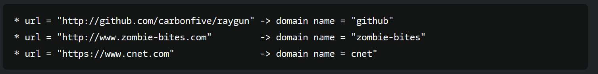
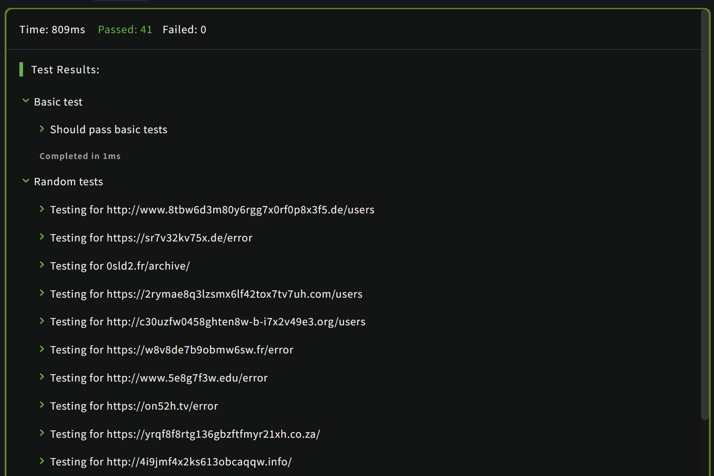

# [Extract the domain name from a URL](https://www.codewars.com/kata/514a024011ea4fb54200004b/train/javascript)
28.06.2024

Write a function that when given a URL as a string, parses out just the domain name and returns it as a string. For example:


```js
function domainName(url){

  if(url.includes('//')){
    if(url.includes('www')){
      return url.split('//')[1].split('.')[1]
    }
    return url.split('//')[1].split('.')[0]
    
  } else if (url.includes('www')){
      return url.split('.')[1]
  }
  
  return url.split('.')[0]
}
```


