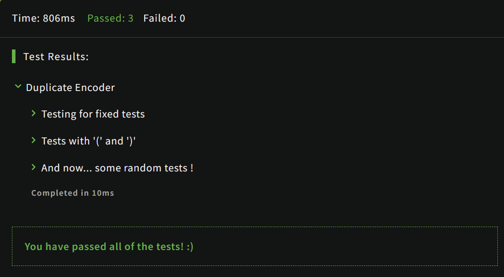

# [Duplicate Encoder](https://www.codewars.com/kata/54b42f9314d9229fd6000d9c/train/javascript)
25.06.2024

The goal of this exercise is to convert a string to a new string where each character in the new string is "(" if that character appears only once in the original string, or ")" if that character appears more than once in the original string. Ignore capitalization when determining if a character is a duplicate.
```js
function duplicateEncode(word){
  if (!word) { return word }

  let result = ''
  for(var letter of word){
    let countLetterInWord = word.split('').filter((element)=> letter.toLowerCase() == element.toLowerCase())

    if(countLetterInWord.length ==0 || countLetterInWord.length ==1){
      result = result + '('
    }else{
      result = result + ')'
    }
  }
  return result;
}
```

