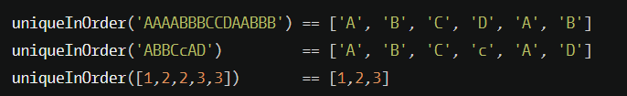
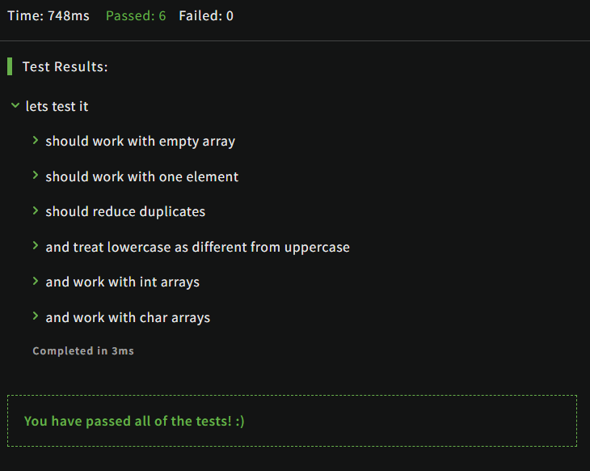

# [Unique In Order](https://www.codewars.com/kata/54e6533c92449cc251001667/train/javascript)
1.07.2024

Implement the function unique_in_order which takes as argument a sequence and returns a list of items without any elements with the same value next to each other and preserving the original order of elements.


```js
var uniqueInOrder = function(iterable){
  const result = []

  for (var index = 0; index < iterable.length; index++){

    if (iterable[index]!=iterable[index+1]){
      result.push(iterable[index])
    }
  }

  return result
}
```



