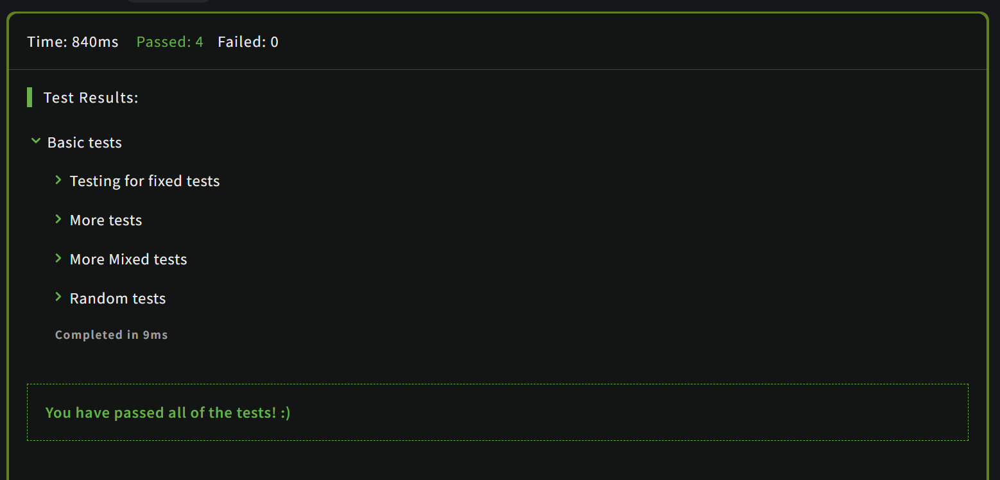

# Isograms
26.07.2024

An isogram is a word that has no repeating letters, consecutive or non-consecutive. Implement a function that determines whether a string that contains only letters is an isogram. Assume the empty string is an isogram. Ignore letter case.

```js
function isIsogram(str){
  
  for (letter of str){
    
    if(str.split('').filter((element)=> element.toLowerCase() == letter).length>1){
      return false
    }
  }
  
  return true
}
```

