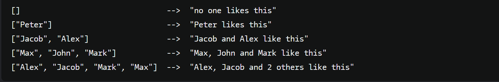
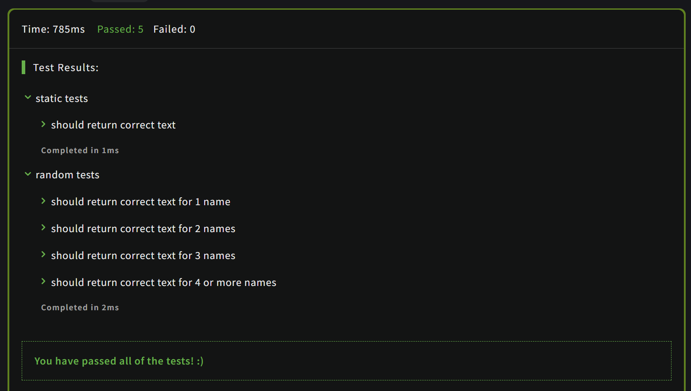

# [Who likes this?](https://www.codewars.com/kata/5266876b8f4bf2da9b000362/train/javascript)
26.06.2024

You probably know the "like" system from Facebook and other pages. People can "like" blog posts, pictures or other items. We want to create the text that should be displayed next to such an item.

Implement the function which takes an array containing the names of people that like an item. It must return the display text as shown in the examples:



Note: For 4 or more names, the number in "and 2 others" simply increases.

```js
function likes(names) {

    switch(names.length) {
        case 0:
          return 'no one likes this'
        
        case 1:
          return `${names[0]} likes this`
        
        case 2:
          return `${names[0]} and ${names[1]} like this`
          
        default:
          let result = `${names[0]}, ${names[1]}`
          
          if(names.length == 3){
            result = `${result} and ${names[2]}`
          } else {
            result = `${result} and ${names.length - 2} others`
          }
        
          return `${result} like this`
          
    }
}
```


