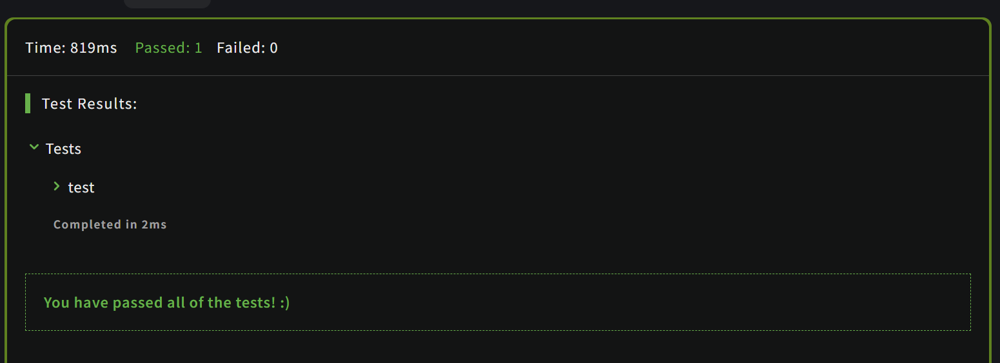

# [XO](https://www.codewars.com/kata/55908aad6620c066bc00002a)
26.06.2024

Check to see if a string has the same amount of 'x's and 'o's. The method must return a boolean and be case insensitive. The string can contain any char.

```js
function XO(str) {
  const countX = str.replace(/[^x]/gi,'').length
  const countO = str.replace(/[^o]/gi,'').length

  return countX === countO
}
```

