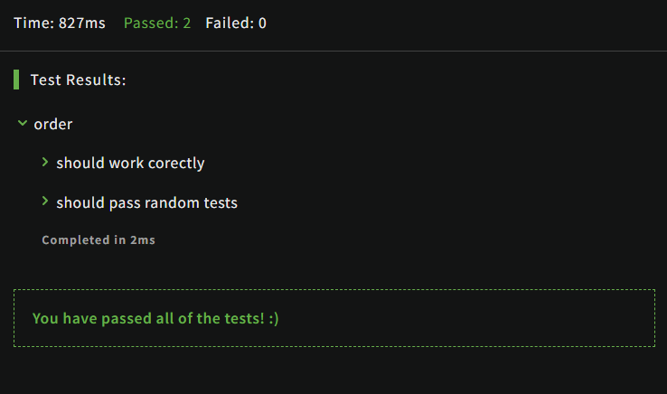

# [Your order, please](https://www.codewars.com/kata/55c45be3b2079eccff00010f/train/javascript)
1.07.2024

Your task is to sort a given string. Each word in the string will contain a single number. This number is the position the word should have in the result.

Note: Numbers can be from 1 to 9. So 1 will be the first word (not 0).

If the input string is empty, return an empty string. The words in the input String will only contain valid consecutive numbers.

```js
function order(words){
  let result=[]
   words.split(' ').map((word)=>{
     result[word.replace(/\D+/g, '')-1] = word
  })
  
  return result.join(' ')
}
```


